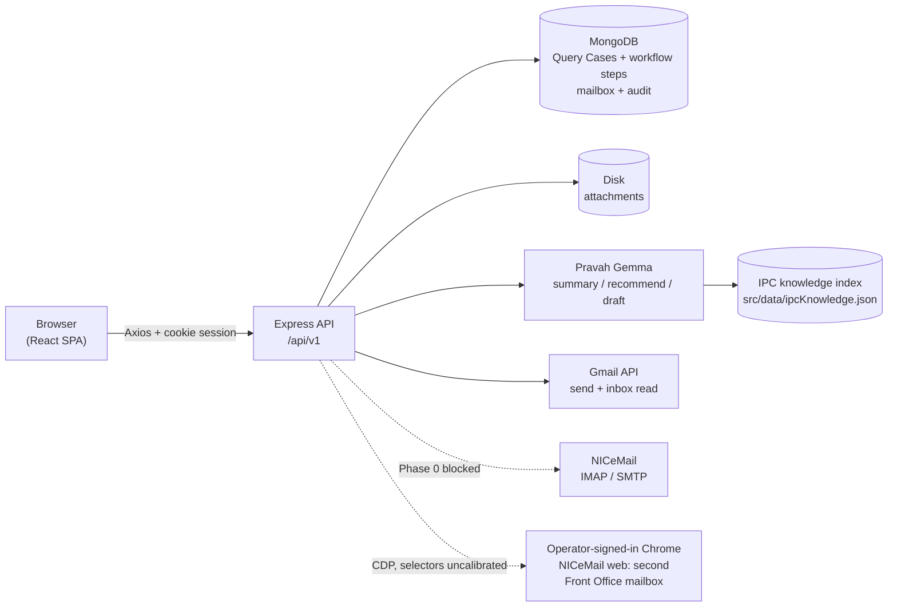
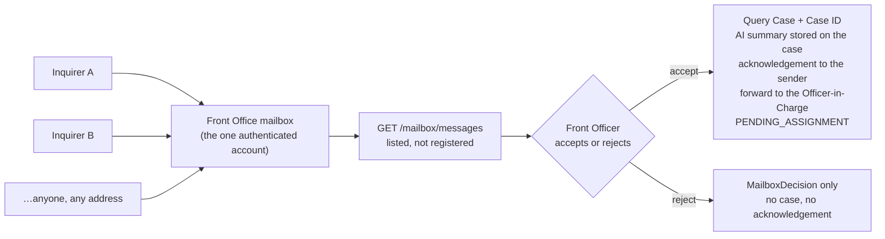

# System Architecture

## Diagram

One persistence tier, with two degradation rules deliberately distinguished:

- **Query Cases** — cases, workflow steps, reviews, response versions and in-app notifications in
  MongoDB, reached through `/api/v1/queries`. True across every user and every browser, and with
  **no fallback**: without a database `/queries/*` answers 503 rather than pretending to save.
- **Mailbox and audit trail** — also MongoDB, attachment bytes on disk. These two still degrade to
  an in-memory store in development when Mongo is unreachable, and report that they have.

MongoDB is **required in production**: `connectDb()` throws when `NODE_ENV=production` and
`DATABASE_URL` is unset or unreachable, and `server.js` awaits it and exits 1 rather than listening
as an instance that cannot store anything. `/queries` is a delta-sync API rather than CRUD per case
— the client hydrates the whole workflow store from `GET /queries` and posts one delta per
committed transition to `POST /queries/persist`.

MongoDB is the **system of record**, not a mirror of whatever a tab believes. A client's reported id
counters are merged with `$max` per key rather than `$set`, so a stale tab cannot regress the
sequence; `POST /queries/persist` answers **409** rather than overwriting a stored case whose
`createdAt` differs from the incoming one; and `connectDb()` calls `Model.syncIndexes()` on every
model, so the schema — not the database's accumulated history — decides what the indexes are.

The frontend never calls an AI or email provider directly — both sit behind the backend.

## Intake

Intake is **N:1 with a human gate**. Many external inquirers, one Front Office mailbox (two when the
NICeMail mailbox is enabled — below), and nothing in between that can register a case.

- **Arrival is not registration.** The Gmail search is `in:inbox [is:unread] to:(<front office
  address>)` with **no sender filter**, so an enquiry from an unknown member of the public is never
  discarded before anyone sees it. Polling only counts what is waiting and says so.
- **The accept is what creates everything, in one server call.**
  `POST /mailbox/messages/:messageId/accept` mints the Case ID, creates the case, records the
  `ACCEPTED` decision, stores the sender parsed from the `From` header as the inquirer, summarises
  the enquiry onto `QueryCase.aiSummary`, sends the
  acknowledgement to *that* address, **and forwards to the Officer-in-Charge** with that same
  summary in the covering note — so an accepted
  case lands at `PENDING_ASSIGNMENT`, not `FRONT_OFFICE_VERIFICATION`. Forwarding used to be a
  second, explicit click on the case page; that button remains, but now only as the recovery path
  for a forward that failed.
- **The Case ID is minted server-side and atomically** —
  `QueryCounter.findOneAndUpdate({key:'counters'}, {$inc:{'value.QRY':1}}, {new, upsert})`,
  formatted `QRY-<year>-<5 digits>`. The browser no longer mints ids on the email path, so two tabs
  can no longer produce the same one.
- **A partial success is reported, not hidden.** The response is
  `{ queryId, created, alreadyDecided, acknowledged, forwarded, aiSummaryStatus, errors }` with HTTP
  200 even when a step failed: a case that exists but was not forwarded is a recoverable state, and a
  500 would lose the Case ID along with it. `aiSummaryStatus` is `GENERATED`, `FALLBACK` or `FAILED`
  rather than a boolean, because the model answering and the deterministic stand-in being used after
  a timeout are different facts.
- **Safe to retry.** There are no cross-document transactions on a standalone MongoDB, so each step
  instead looks for its own artefact — the decision, the inbound `EmailMessage`, an
  `ACKNOWLEDGEMENT` message, a `FORWARD` message — before acting. Pressing ✓ again finishes what
  did not complete and repeats nothing that was recorded — an unconfirmed NICeMail acknowledgement
  was not, and is sent again.
- **A rejection is recorded, not erased.** `POST /mailbox/messages/:id/decision` writes a
  `MailboxDecision` and nothing else; the message stays listed and traceable.
- **The first decision on a message wins**, so a double-click or two Front Officers on one inbox
  cannot produce two cases for one email.

**Two Front Office mailboxes, when enabled.** With `NIC_BROWSER_MAILBOX=true` a second Front Office
account signs in as `NIC_EMAIL`, and its inbox is the NICeMail mailbox, read by the browser agent
through the operator's signed-in Chrome over CDP and stored in MongoDB. Mail is routed by the
mailbox it arrived in, not by sender, and both mailboxes feed the same accept and the same workflow.
The accept records the mailbox on the case as `sourceMailbox`, server-side; a NICeMail case's
acknowledgement, final response and their retries go out through the signed-in NICeMail tab, and the
forward to the Officer-in-Charge stays on `EMAIL_TRANSPORT`. The browser code is imported lazily, so
the backend starts without Chrome. A send whose Send was pressed but not confirmed is reported as
**unconfirmed** — not recorded, and never treated as delivered — because a retry could reach the
inquirer twice. The agent's selectors have not yet been calibrated against the live NICeMail page;
see [NIC_BROWSER_AGENT.md §17](../NIC_BROWSER_AGENT.md#17-two-front-office-mailboxes) for the flow
and its open items.

## Components

- **Frontend** — React 19 + Vite 8 SPA. Routes generated from the RBAC grant table; Zustand for
  domain state, synced to the API. See [frontend-architecture.md](./frontend-architecture.md) and
  [frontend/README.md](../../frontend/README.md).
- **Backend** — Node.js + Express 5 API, ESM throughout. Controller → service pattern, MongoDB via
  Mongoose. See [backend-architecture.md](./backend-architecture.md) and
  [backend/README.md](../../backend/README.md).
- **Workflow engine** — implemented **client-side** in `useWorkflowStore`, where the single-writer
  `applyTransition` guarantees one audit event per transition and supports dynamic review levels.
  The model is described in [workflow-engine.md](./workflow-engine.md); moving it server-side is the
  outstanding work.
- **AI grounding layer** — `backend/src/data/` indexes IPC guidance documents and retrieves
  per-question evidence, so the model answers from supplied passages rather than from its own
  knowledge.

## Request Flow

1. The browser boots and asks `GET /auth/me`. `HydrationGate` loads the workflow store from
   `GET /queries` only once that session is known, because `/queries` requires one.
2. Sign-in posts to `POST /auth/login`; the server sets an httpOnly `qms.session` cookie which the
   browser then attaches automatically — including to `` and `<iframe>` attachment URLs, which
   could not carry an auth header.
3. Express applies `helmet` → `cors(credentials)` → `morgan` → `express.json()` → `cookie-parser` →
   routes → `notFound` → `errorHandler`. Each route declares its own `verifyToken` →
   `verifyRole`/`verifyAction` chain; there is no global guard.
4. Workflow actions run through the client store, which validates role + state, commits the
   transition, appends an audit event, and posts the delta to `POST /queries/persist`.
5. Actions with an external effect — sending, forwarding, ingesting, uploading, AI calls — go to the
   API, which records its own server-side audit event.
6. Two sequences are owned end-to-end by the server rather than orchestrated step by step from the
   browser: accepting a mailbox message (`POST /mailbox/messages/:id/accept`) and granting final
   approval (`POST /queries/:queryId/final-approval`). Both mutate several documents, both must
   survive a closed tab, and both answer 200 with per-step outcomes rather than collapsing to a
   single success or failure. The client calls one endpoint and reads the result back with
   `refreshFromServer()` instead of reconstructing it.

Granting final approval is where the second of those matters most. The Officer-in-Charge's session
authorises `FINAL_APPROVE`; the **server** then sends the response under the Front Office identity
it already holds and closes the case. The browser used to attempt that send itself against the
Front-Office-only `POST /emails/response`, on the approving officer's session, and was refused with
a 403 every time. No role gained the `DISPATCH` permission to fix it — the work moved, not the
grant.

## Where the two audit trails differ

Both now land in the same MongoDB `AuditEvent` collection, so the difference is no longer *where*
they live — it is what they describe and what they are called:

- **Case-lifecycle events** (`useWorkflowStore.auditEvents`) — received, forwarded, assigned,
  reviewed, dispatched. Written through `POST /queries/persist`, which takes the actor from the
  session and not from the body. These drive the case timeline and the toast layer.
- **Server audit events** (`/audit`) — what the *server actually did*: logins, authorization
  denials, emails sent/failed, AI calls with latency and fallback provenance, attachment
  uploads/downloads. True across all users, and what the Admin console reports.

The client reads `{event, actor, at}` while the collection stores `{action, actorRole, timestamp}`;
`GET /queries` translates on the way out so the client never learns a second vocabulary.

The admin console still labels client-derived figures "This browser only". That label is now stale
and has not yet been removed.
