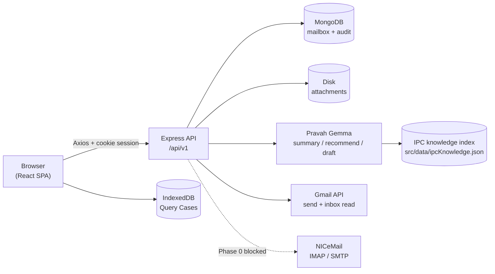

# System Architecture

## Diagram

Two persistence stores, deliberately distinguished:

- **Server-side** — the mailbox and the audit trail in MongoDB, attachment bytes on disk. True
  across every user; MongoDB is optional and both subsystems degrade to memory without it.
- **Browser-side** — Query Cases, workflow steps, reviews, response versions and in-app
  notifications in IndexedDB (Dexie). **Local to one browser profile.** There is no `/queries`
  endpoint; this is the project's principal architectural gap.

The frontend never calls an AI or email provider directly — both sit behind the backend.

## Components

- **Frontend** — React 19 + Vite 8 SPA. Routes generated from the RBAC grant table; Zustand +
  Dexie for domain state. See [frontend-architecture.md](./frontend-architecture.md) and
  [frontend/README.md](../../frontend/README.md).
- **Backend** — Node.js + Express 5 API, ESM throughout. Controller → service pattern, MongoDB via
  Mongoose. See [backend-architecture.md](./backend-architecture.md) and
  [backend/README.md](../../backend/README.md).
- **Workflow engine** — implemented **client-side** in `useWorkflowStore`, where the single-writer
  `applyTransition` guarantees one audit event per transition and supports dynamic review levels.
  The model is described in [workflow-engine.md](./workflow-engine.md); moving it server-side is the
  outstanding work.
- **AI grounding layer** — `backend/src/data/` indexes IPC guidance documents and retrieves
  per-question evidence, so the model answers from supplied passages rather than from its own
  knowledge.

## Request Flow

1. The browser boots, `HydrationGate` waits for IndexedDB hydration and `GET /auth/me`.
2. Sign-in posts to `POST /auth/login`; the server sets an httpOnly `qms.session` cookie which the
   browser then attaches automatically — including to `` and `<iframe>` attachment URLs, which
   could not carry an auth header.
3. Express applies `helmet` → `cors(credentials)` → `morgan` → `express.json()` → `cookie-parser` →
   routes → `notFound` → `errorHandler`. Each route declares its own `verifyToken` →
   `verifyRole`/`verifyAction` chain; there is no global guard.
4. Workflow actions run through the client store, which validates role + state, commits the
   transition, appends an audit event, and persists the delta to IndexedDB.
5. Actions with an external effect — sending, forwarding, ingesting, uploading, AI calls — go to the
   API, which records its own server-side audit event.

## Where the two audit trails differ

There are two, and conflating them causes confusion:

- **Client audit events** (`useWorkflowStore.auditEvents`, IndexedDB) — the *case lifecycle*:
  received, forwarded, assigned, reviewed, dispatched. Browser-local. These drive the case timeline
  and the toast layer.
- **Server audit events** (`/audit`, MongoDB) — what the *server actually did*: logins, authorization
  denials, emails sent/failed, AI calls with latency and fallback provenance, attachment
  uploads/downloads. True across all users, and what the Admin console reports.

The admin console labels client-derived figures "This browser only" precisely so the two are not
read as one.
