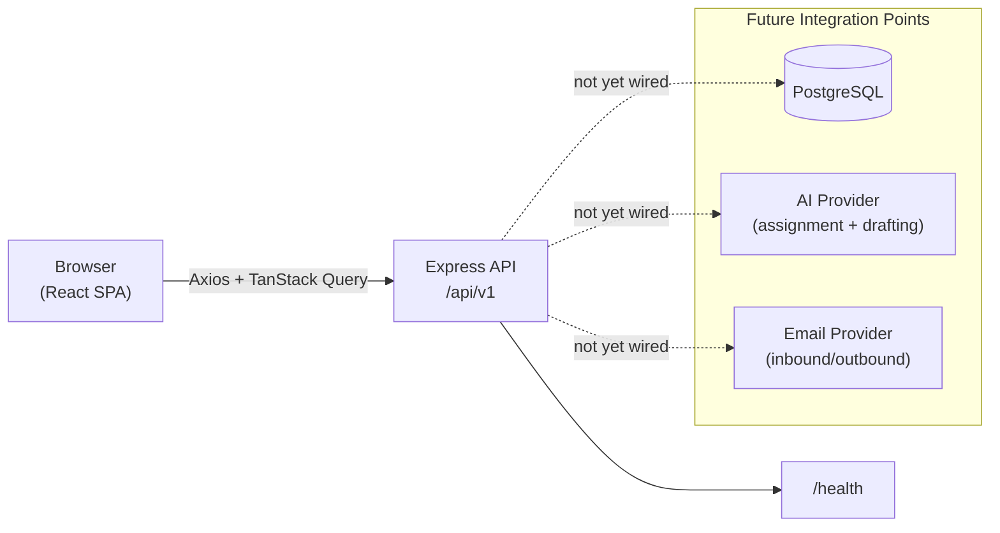

# System Architecture

## Current Phase Diagram

Today, the only real request path is `Browser → Express /api/v1/health`, used to prove the
two apps are wired together (see the header connectivity badge in
`frontend/src/components/layout/Header.jsx`). Everything else in the frontend renders from
local mock data (`frontend/src/constants/`).

## Components

- **Frontend** — React 19 + Vite 8 SPA. Feature-oriented structure under `frontend/src/`. See
  [frontend-architecture.md](./frontend-architecture.md).
- **Backend** — Node.js + Express 5 API. Controller → service pattern, PostgreSQL-ready. See
  [backend-architecture.md](./backend-architecture.md).
- **Workflow Engine (future)** — the dynamic review-step model described in
  [workflow-engine.md](./workflow-engine.md). Not implemented yet; today it exists only as a
  documented shape and as mock data (`frontend/src/constants/mockQuery.js`).

## Request Flow (Current)

1. Frontend boots with a mock authenticated user (Neha Singh) — no login round-trip.
2. `useHealthCheck` (TanStack Query) calls `GET /api/v1/health` via the centralized Axios
   client, polling every 30s.
3. Express applies `helmet` → `cors` → `morgan` → `express.json()` → routes → `notFound` →
   `errorHandler`, and responds with a small JSON health payload.
4. All other pages render entirely from local constants — no other network calls exist yet.

## Request Flow (Future, Not Implemented)

Real query CRUD, assignment, drafting, review, approval, and dispatch will each become an
authenticated API call following the same Express pipeline, backed by PostgreSQL, with AI and
email providers integrated as external services behind the backend (never called directly
from the frontend). See [api/api-plan.md](../api/api-plan.md) for the planned resource shape.
