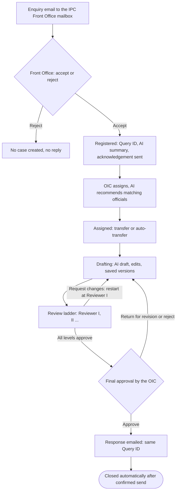

# AI-powered IP Stakeholder's BRIDGETECH — End-to-End Workflow & Demo Script

Oct 1, 2026 · @Abhinash Pritiraj

Living version (Claude Doc): https://claude.ai/code/artifact/a246fd74-f07c-42c8-9b15-9dea3b27951d

# Part 1 — Complete End-to-End Workflow

## Overview

AI-powered IP Stakeholder's BRIDGETECH carries every stakeholder enquiry emailed to the Indian Pharmacopoeia Commission (IPC) from the Front Office inbox to a reviewed, approved and dispatched reply. Each query keeps one Query ID, one email thread and one audit trail from arrival to closure. AI assists at every stage; people take every decision.

In short: an enquiry arrives, the Front Office accepts it, and BRIDGETECH registers it, acknowledges the sender and forwards it to the Officer-in-Charge. The Officer-in-Charge assigns an official, who drafts the reply with AI help. Reviewers approve it level by level, the Officer-in-Charge grants final approval, and the reply is emailed and the query closed automatically.

Rejected mail stops at the Front Office with no case created. Once registered, a query only moves forward, except when a reviewer or the OIC sends it back to drafting.

### Who does what

| Role | Responsibilities | Home screen |
| --- | --- | --- |
| External inquirer | Emails IPC; receives the acknowledgement and the final response. Holds no account and never signs in. | Email only |
| Front Office (FO) | Screens the IPC Mailbox; accepts genuine enquiries and rejects the rest; monitors dispatch; retries any email that did not go through. | Front Office Dashboard |
| Officer-in-Charge (OIC) | Assigns each registered query to an official using AI recommendations; grants final approval, returns for revision or rejects. | Officer-in-Charge Dashboard |
| Assigned Official | Investigates and drafts the response with AI assistance; builds the review chain; submits for review; may transfer the query before drafting starts. | Officer Dashboard |
| Reviewer | Approves the draft or requests changes at their review level. | Reviewer Dashboard |
| Admin / Super Admin | Oversight: system dashboard, audit trail, email and AI activity. Admin can pull a query back to an earlier stage. Super Admin can act at every step. | System Dashboard |

### Workflow stages

| Stage (status shown) | Owner | What happens | Moves to |
| --- | --- | --- | --- |
| Received, Front Office Verification | System, on FO acceptance | Case registered, Query ID issued, AI summary generated, acknowledgement sent | Pending Assignment, once the forward to the OIC is sent |
| Pending Assignment | OIC | AI recommends officials; OIC assigns | Assigned |
| Assigned | Assigned Official | Official studies the case; may transfer it; optional action deadline runs | Drafting (a transfer keeps it Assigned) |
| Drafting | Assigned Official | AI draft, edits, saved versions, review chain set up | Under Review |
| Under Review | Reviewer at the current level | Approve moves to the next level; Request changes returns it | Pending Final Approval, or Returned for Revision |
| Returned for Revision | Assigned Official | Revise using the comments; resubmit | Under Review, restarting at Reviewer I |
| Pending Final Approval | OIC | Approve, Return for revision, or Reject | Ready for Dispatch, or Returned for Revision |
| Ready for Dispatch, Dispatched | System | Approved response emailed to the inquirer | Closed, once the send is confirmed |
| Closed | — | Complete, permanent record | Reopened only by Admin pullback |

Every case also carries a business status — Open, In Progress or Closed — used on dashboards and reports.

## 1. Query reception and registration

An enquiry becomes a registered query only when a Front Officer accepts it; at that moment BRIDGETECH issues a unique Query ID in the form **QRY-YYYY-NNNNN** (for example QRY-2026-00007). Anyone may write to IPC from any address, and nothing is registered automatically.

**How enquiries arrive.** Stakeholder emails to the IPC Front Office mailbox are brought into BRIDGETECH continuously and listed in the **IPC Mailbox Inbox**. The Front Officer can also press **Check IPC Mailbox** or **Sync now** for an immediate refresh. A notification — "N messages awaiting validation" — appears anywhere in the application when new mail is waiting.

**What the inbox shows.**

- Filter tabs: **All mail**, **Awaiting** (not yet accepted or rejected) and **Junk**.
- Search across sender, subject and message text; 50 messages per page.
- Columns: S.No. · From / Sender · Subject & Content · Received On · Query Case · Actions.
- Markers for unread mail, attachment count, and the linked case: a Query ID link, a **Rejected** tag or an **Awaiting validation** tag.

**Validating a message.** The Front Officer opens the message to read it in plain-text or formatted view, with links and remote images disabled for safety. Attachments can be previewed (PDF, images, text, audio, video) or downloaded. A side panel shows whether the message is already linked to a case.

**The decision.** From the inbox list the Front Officer takes one of two decisions:

| Action | Confirmation shown | Result |
| --- | --- | --- |
| **Accept (✓)** | "Register & forward?" | Registers the enquiry as an IPC query case, acknowledges the sender and forwards it to the Officer-in-Charge (Section 3) |
| **Reject (✗)** | "Reject?" | Not an IPC query: no case is created and no acknowledgement is sent |

The first decision on a message wins, so two Front Officers cannot register the same email twice. Once a decision is recorded, the accept and reject buttons disappear for that message.

**What registration records.** The new case holds the subject, the full enquiry text, the inquirer's name and email address (taken from the sender), the received date, all attachments, and the source mailbox. It is created with Normal priority and recorded in the audit trail as received and registered.

## 2. AI-powered query processing

AI works on every enquiry twice before an official sees it: it screens the mailbox for junk, and on acceptance it writes a structured summary of the enquiry that travels with the case. Both are assistive; a person can override either.

**AI junk screening.** Incoming mail is checked by rules and then by the AI model, which judges content rather than sender and defaults to "genuine" when unsure.

- Clear non-enquiries — delivery-failure notices, mail-system messages, mail sent by BRIDGETECH itself — are flagged as junk with certainty.
- Likely non-enquiries — bulk lists, no-reply senders, out-of-office replies, empty messages — are passed to the AI model for a second opinion.
- Junk is gathered under the **Junk** tab. A **Rescue** ("Not junk") button returns any message to the queue and protects it permanently.
- Junk confirmed with high confidence, and mail the Front Office rejected, is cleared automatically after a retention window; each row shows when ("purges in Nh"). Accepted, rescued or case-linked mail is never cleared.

**AI enquiry summary.** The moment the Front Office accepts an enquiry, BRIDGETECH generates an **AI Summary** and stores it on the case:

| Element | What it gives the reader |
| --- | --- |
| Summary | A short, plain account of what the inquirer is asking |
| **Key Points Raised** | The individual points or questions in the enquiry |
| **Topics** | The subject areas involved, including the drug or monograph named and the IPC domain |

The summary card states whether it was produced by the AI model or by a simpler offline method, and carries the note "Assistive only — verify before taking official action." Any user working on the case can press **Re-generate** to refresh it.

**Where the summary goes.** It appears on the case page for every role, and it opens the forwarding email to the Officer-in-Charge as a clearly marked AI query summary for Officer-in-Charge review. It also feeds the AI official recommendation (Section 4) and the AI draft (Section 6).

**Acknowledgement drafting.** The acknowledgement to the inquirer is not written by AI. It is a fixed, approved IPC letter sent automatically on acceptance (Section 3), which keeps the first official reply consistent.

## 3. Front Office workflow

The Front Office is the human gate: one **Accept** performs registration, AI summary, acknowledgement and forwarding to the Officer-in-Charge in a single step, so a genuine enquiry reaches the OIC within moments of being validated.

**What one acceptance does, in order:**

1. **Registers** the case and issues the Query ID (Section 1).
2. **Summarises** the enquiry with AI and stores the summary on the case (Section 2).
3. **Acknowledges** the inquirer by email with the standard IPC letter:
   - Subject: "Acknowledgement of Query Received – Indian Pharmacopoeia Commission \[QRY-…\]", so the inquirer has the Query ID for reference.
   - Body: addressed to the inquirer, referencing their email, confirming the query "has been duly received and forwarded to the concerned division for examination", signed by the Office of the Secretary-cum-Scientific Director, IPC, Ghaziabad.
4. **Forwards** the case to the Officer-in-Charge by email ("Fwd: \<subject> \[QRY-…\]") with the AI summary, the original enquiry and all attachments. If any attachment cannot be read and verified, the forward is held back rather than sent incomplete.
5. **Moves** the case to **Pending Assignment** and notifies the OIC: "QRY-… awaiting assignment".

A confirmation message summarises the outcome, for example "Query case QRY-… created — AI summary generated · acknowledgement sent · forwarded to the Officer-in-Charge".

**When something does not go through.** Every outcome is recorded against the case, and the case page offers a recovery action:

| Situation | Action offered to the Front Office |
| --- | --- |
| Acknowledgement not sent | **Retry sending** |
| Forward to the OIC not sent | **Retry forwarding** or **Forward to Officer-in-Charge** |
| A send whose delivery could not be confirmed | **It was sent** or **It was not sent — send it** |

Each email to an inquirer is sent at most once per case, however many times a button is pressed, so stakeholders never receive duplicates.

**Front Office Dashboard.** Tiles for Total Queries, New / Incoming, Pending Assignment, Awaiting Dispatch and Dispatched, each with a 7-day trend. Below them: the query list for the selected tile, case-volume and status charts, and an activity feed. Later in the lifecycle the Front Office also monitors dispatch (Section 8).

## 4. OIC dashboard and query assignment

The Officer-in-Charge assigns each registered query to an official in one click, guided by AI recommendations that rank officials by how well their expertise matches the enquiry. The AI recommends; the OIC decides and can always choose someone else.

**Officer-in-Charge Dashboard.** Tiles for Total, **Awaiting Assignment**, In Progress, **Awaiting Final Approval**, Approved and Returned, each opening its list of queries. The OIC also receives an in-app notification for every newly forwarded query.

**Reviewing the query.** Opening a query shows the case summary bar, the AI Summary with key points and topics, the email thread with the original enquiry, the attachments and the workflow timeline — everything needed to judge who should handle it.

**AI Official Recommendations.** For a query awaiting assignment, the AI compares the enquiry text and its summary with each official's division and areas of expertise. It shows:

- A ranked list of best matches (top two shown, "Show N more matches" for the rest), each with a **% Match** score.
- The official's name, division and email.
- Their expertise tags, with the keywords that matched the enquiry highlighted.
- **Re-analyze**, to run the recommendation again.
- An **Assign to {name}** button on each recommendation.

If the AI service is unavailable, a keyword-based ranking is shown instead, so assignment is never blocked.

**Manual choice.** Under **Or Manual Assignment**, the OIC can **Choose from full directory**, select any official and press **Assign Selected Official**.

**What assignment records.** The case moves to **Assigned** and the chosen official becomes its owner. The assignment page shows whether the OIC accepted the AI's recommendation or chose differently, and the audit trail logs the assignment and any override ("AI Recommendation accepted by OIC" or "Selected & assigned by Officer-in-Charge"). Officials are notified in-app.

Priority, due date and category are not set at assignment in the current build (see Appendix A).

## 5. Query transfer workflow

A query can change hands three ways — a transfer by the assigned official, an automatic transfer when the official does not act in time, and an Admin pullback — and every move is recorded with who, when and why. In the current build the assigned official transfers directly; there is no OIC approve-or-reject step (flagged in Appendix A).

### 5.1 Transfer by the assigned official

Available to the current assignee while the query is **Assigned**, before drafting begins. Once drafting starts, reassignment is an Admin pullback (5.3).

1. The official presses **Transfer Query**. The dialog shows the Case ID, subject and current assignee.
2. **Select Colleague / Official** (required). With the search box empty, **AI Recommended Officials** are listed, each with a % Match score, division and expertise tags. Colleagues can also be searched by name, email or expertise.
3. **Reason for Transfer** (required), from a fixed list, with optional notes:
   - Query belongs to another department
   - Colleague has better expertise
   - Workload redistribution
   - Official is unavailable
   - Other (notes required)
4. **Continue to Transfer** opens a confirmation summary: Transferred From, Transferred To, Transferred By and Reason.
5. **Confirm & Transfer** completes it.

The query stays at **Assigned** and moves into the new assignee's work queue; the new assignee is notified in-app immediately. The previous holder loses access to the case.

### 5.2 Automatic transfer on inactivity (configurable)

When enabled for a deployment, every assignment starts an action clock. If the official has not begun drafting before the deadline, BRIDGETECH reassigns the query to the next AI-ranked official who has not already held it.

- The case page shows an **Action Timeline & Auto Transfer Status** card: Assigned Officer, Assignment Time, Action Deadline, a live Remaining Time countdown, the status and the number of automatic transfers.
- The new assignee is notified: "Query automatically transferred to you", with the new deadline.
- If no eligible official remains, the transfers stop, the query stays with its current holder, and the OIC is alerted: "Automatic transfer stopped … please reassign it manually."
- The time limit is set per deployment, and the feature is off unless switched on.

### 5.3 Admin pullback

An Admin can return a query to an earlier stage at any point — for example after a wrong assignment.

- **Pullback Query** → **Pull Back To** (a stage the query has already passed through) → **Reason for Pullback** → **Confirm Pullback**.
- Reasons include Incorrect assignment, Incorrect information, Requires correction, Requires additional review, Sent to wrong department, Response requires modification, Administrative intervention, Query needs to be reassigned, and Other (remarks required).
- Pulling back to Pending Assignment or earlier clears the assignee so the OIC can reassign. The timeline marks the step: "Pulled back from X by Y (reason)".

### Transfer history and audit trail

- While the query is Assigned, the **Transfer History** table on the case page lists every move: from, to, time, type (Manual or Automatic) and reason.
- The audit trail keeps the permanent record of each transfer, automatic transfer and pullback, with the reason and the people involved.
- The case history, drafts, versions and audit trail travel with the query; nothing is lost on transfer.

## 6. AI-assisted query resolution

The assigned official starts from an AI first draft built only from IPC's own reference material, answered question by question, and then edits it into the official reply. Nothing the AI writes leaves IPC without the official's edits, the review chain and the OIC's approval.

**Understanding the query.** The official's **Officer Dashboard** lists their queries by stage: Assigned to me, Drafting, Submitted for Review, Returned for Revision and Completed. **My Work** gathers everything awaiting their action. On the case page the official reads the AI Summary, key points and topics, the original email and its attachments.

**Generate AI draft.** On the Drafting page the official presses **Generate AI draft**. BRIDGETECH then:

1. Breaks the enquiry into the individual questions it asks.
2. Searches IPC's indexed reference library — 22 IPC documents divided into 412 passages, with a glossary of IPC terms — for passages relevant to each question.
3. Keeps only passages that genuinely match the question; a question with no matching evidence is not sent to the AI at all.
4. Answers each question from that evidence alone. Where the material does not cover a point, the draft says so ("The available IPC material does not establish this requirement") instead of guessing.
5. Assembles a formal IPC letter: a "\[FIRST DRAFT\]" marker, the inquirer's address block, a "Sub:" line, the answers, the IPC disclaimer and signature.

If the AI service is unavailable, a standard template draft is used and the official sees "AI assistant unavailable — A standard template was used instead".

**Editing and versions.**

- The draft opens in an editor; the official corrects, completes and finalises the wording.
- **Save new version** stores each revision as v2, v3 and so on. The first is labelled "AI generated"; later ones "Officer revision" or "Reviewer requested revision".
- The **Version history** card keeps every version; nothing is overwritten.
- The page reminds the official that AI-generated content never becomes the final response automatically.

**Moving to review.** The official builds the review chain and presses **Submit for review** (Section 7). Submission needs at least one saved version and at least one review level.

## 7. Review and approval workflow

Every response climbs a review ladder — Reviewer I, Reviewer II and as many further levels as the query needs — and then goes to the Officer-in-Charge for final approval. Any request for changes sends it back to the official, and the revised version climbs the whole ladder again from Reviewer I.

### 7.1 Building the review chain

The assigned official sets up the ladder in the **Review chain** card on the Drafting page: **Add Reviewer I**, **Add Reviewer II** and so on, choosing a reviewer for each level. Levels are added in order, and any level not yet reviewed can be removed. A typical chain is Reviewer I followed by Reviewer II; the number of levels is not fixed.

### 7.2 Review levels

1. **Submit for review** moves the query to **Under Review**. Reviewer I's level becomes current and reviewers are notified.
2. The reviewer opens the draft read-only from the **Reviewer Dashboard** (Awaiting My Review) and records a decision with optional **Comments**:
   - **Approve** — the comment is optional. The query passes to the next level, or to the OIC after the last level.
   - **Request changes** — a comment is mandatory. The query returns to the official as **Returned for Revision**.
3. Only the reviewer assigned to the current level can act on it; others see whose turn it is.
4. Each decision is tied to the exact version reviewed, so a comment is never read against later text.

### 7.3 Handling revisions

- The reviewer's comment appears on the Drafting page under "Returned for revision".
- The official revises, saves a new version (labelled "Reviewer requested revision") and resubmits.
- All levels reset, and the revised response passes Reviewer I, Reviewer II and any further levels again before reaching the OIC.

### 7.4 Final approval by the Officer-in-Charge

After the last level approves, the query moves to **Pending Final Approval** and the OIC is notified. On the **Final approval decision** page the OIC reads the response and enters optional **Comments**, then chooses:

| Decision | Comment | Result |
| --- | --- | --- |
| **Approve** | Optional | The approved version is locked and the response is sent to the inquirer straight away (Sections 8–9) |
| **Return for revision** | Required | Returned for Revision; the full ladder repeats from Reviewer I before final approval |
| **Reject** | Optional | Also returns the response to the official for rework; it does not close or cancel the query |

Reviewers and the OIC cannot edit the text themselves; changes always go back through the official, so the version history shows exactly who wrote what.

## 8. Communication with external inquirers

The inquirer hears from IPC twice by email — an acknowledgement on registration and the approved response on final approval — and both carry the Query ID. Every message, inbound and outbound, is kept on the case's email thread.

**The final response.** When the OIC presses **Approve**, BRIDGETECH sends the response from the IPC Front Office mailbox with no further manual step:

- To: the inquirer's email address.
- Subject: "Re: \<original subject> \[QRY-…\]".
- Body: the approved text, with the draft marker removed and the standard IPC disclaimer and signature applied.
- The response is sent exactly once, even if approval is pressed repeatedly or from two screens.

**Email thread on the case.** The **Email thread** panel shows the full correspondence, newest message expanded, with filters **All Emails**, **Received Only** and **Sent Only**. Each message carries a direction tag ("Received by IPC" or "Sent by IPC") and a type:

| Type | Direction |
| --- | --- |
| Original enquiry | Received |
| Acknowledgement | Sent |
| Forwarded to Officer-in-Charge | Sent (internal) |
| Final response | Sent |

**Dispatch monitoring.** The Front Office **Dispatch** page reports the status of each approved response: "Response sent automatically — Query closed" in the normal case. If a send fails, it offers **Retry sending response**; if delivery could not be confirmed, it asks the Front Office to record **It was sent** or **It was not sent — send it**.

## 9. Query closure

A query closes automatically the moment its approved response is confirmed sent — no separate closing step — and a query is never shown as closed unless the inquirer was actually sent the reply.

**Closure sequence.**

1. The OIC grants final approval; the approved version is locked as final and can no longer be edited.
2. The status moves to **Ready for Dispatch** and the response is sent.
3. On a confirmed send the status moves to **Dispatched**, then **Closed**; the business status becomes Closed.
4. The audit trail records final approval granted, response dispatched and query closed, in that order.
5. The Front Office is notified that the query was dispatched.

**If the send fails.** The approval stands, and the query waits at Ready for Dispatch with the failure recorded against it. The Front Office is notified and can use **Retry sending response**. Closure happens only after a send that actually took place.

**The permanent record.** A closed query keeps:

- The original enquiry, attachments and AI Summary.
- Every response version, including the locked final version.
- Every review and final-approval decision, with comments.
- Every assignment, transfer and pullback.
- The complete email thread.
- The full audit history and the **Workflow progress** timeline.

Closed queries remain searchable in the **IPC Query Registry**, appear under **Recently closed** on the Reviewer Dashboard, and count towards dashboard and report totals. An Admin can pull a closed query back to an earlier stage, though issuing a second response is limited in the current build (Appendix A).

## 10. Dashboards, tracking and audit trail

Every role signs in to a dashboard of its own pending work, every query shows where it stands in its lifecycle, and every action — human, AI or system — is written to an audit trail.

### 10.1 Role dashboards

All dashboards share one layout: clickable count tiles with each tile's share of the total and a 7-day trend; the list of queries behind the selected tile with status, priority and stage progress ("N of 11"); charts for **Case volume** (this week, this month, 12 weeks), **Status mix** and **Queue breakdown**; and an **Activity overview** of recent events.

| Dashboard | Tiles |
| --- | --- |
| Front Office | Total Queries, New / Incoming, Pending Assignment, Awaiting Dispatch, Dispatched |
| Officer-in-Charge | Total, Awaiting Assignment, In Progress, Awaiting Final Approval, Approved, Returned |
| Officer (Assigned Official) | Total, Assigned to me, Drafting, Submitted for Review, Returned for Revision, Completed |
| Reviewer | Total, Awaiting My Review, Approved by me, Returned by me; plus Recently closed |
| System (Admin, Super Admin) | Total, Open, In Progress, Closed |

### 10.2 Finding and following queries

- **IPC Query Registry** ("Assigned Queries" for officials): search by Query ID, subject or inquirer; filter by priority; paged.
- **My Work**: an official's or reviewer's own pending items.
- **Command palette** (Ctrl/Cmd + K): jump to any accessible query or page.
- **Workflow progress** timeline on every case: Enquiry submitted → Verified & acknowledged → Forwarded to Officer-in-Charge → Assigned to an official → Response drafted (vN) → Reviewer I, II … → Final approval → Response dispatched → Inquirer received response. Returns and pullbacks are marked on it.
- **Officials** card: the inquirer, Front Office, OIC, assigned official and each reviewer, marked Completed, Current or Pending.
- **Notifications**: a bell with the user's in-app notifications and a link to each case, plus a Notification Center; confirmation messages appear as each action completes.

### 10.3 Audit trail and accountability

- **Audit history** on each case: an append-only record, newest first, showing event, actor, details and time. It covers registration, acknowledgement, forwarding, AI summary, assignment and any override, transfers, drafts, review decisions, final approval, dispatch and closure.
- Each event is stamped by the server with the time and the signed-in user's role; AI and automatic system actions are recorded as such.
- **Admin console** (Admin and Super Admin): **Overview** (system events, email actions, AI generations and failures today, case status, 7-day volume, processing funnel); **Audit Trail** searchable by event, actor, result, Query ID and date range; **AI Agent** activity (summaries, drafts, recommendations, failed calls, AI-versus-fallback health, median response time); **Email Activity**; and the **Roles** permission matrix.
- **Reports** (OIC, Admin, Super Admin): total queries, in drafting, under review and closed, with 12-week intake and status charts.

### 10.4 Access control

- Secure sign-in with an email and password, or a Google account linked to a staff record; sessions expire after 8 hours.
- Six roles, each seeing only the screens and actions it is permitted; refused actions are logged.
- Case-level access: officials see the queries they hold or worked on, reviewers the queries they review; Front Office, OIC and Admin see all.
- Interface labels can be switched between English and Hindi.

## 11. AI capabilities across the workflow

BRIDGETECH applies AI at every stage from intake to oversight, always as an assistant: it screens, summarises, recommends and drafts, while people accept, assign, edit, review and approve. Every AI feature has a fallback, so the workflow never stops when the AI service is unavailable.

| AI capability | Stage and user | What it does | Value to IPC | Human control |
| --- | --- | --- | --- | --- |
| Junk screening | Intake · Front Office | Separates delivery failures, bulk mail, auto-replies and empty mail from genuine enquiries | Front Office time goes to real enquiries; inbox stays clean | Junk tab is reviewable; **Rescue** restores any message; registering a case is always a human accept |
| Enquiry summary, key points and topics | Registration · all roles | Summarises the request, lists the points raised, identifies the drug or monograph and IPC domain | Every reader grasps the query in seconds; one consistent summary from OIC to reviewer | Marked "assistive only"; **Re-generate**; source shown (AI or offline) |
| AI summary in the OIC forward | Forwarding · OIC | Opens the forwarding email with the summary | OIC can triage from the email itself | OIC still decides the assignment |
| Official recommendation | Assignment · OIC | Ranks officials by match between the enquiry and their division and expertise, with % Match and matched keywords | Faster, better-matched assignment; less dependence on memory of who knows what | OIC picks any official; overrides are recorded |
| Transfer recommendations | Transfer · Assigned Official | Suggests colleagues best suited to take over | Queries reach the right expert sooner | Official chooses and must give a reason |
| Automatic reassignment (configurable) | Assigned · system | Moves an idle query to the next AI-ranked official after the action deadline | No query sits unattended | OIC alerted when the ranked list is exhausted; Admin pullback |
| Evidence-grounded response drafting | Drafting · Assigned Official | Splits the enquiry into questions and answers each only from IPC's indexed reference library, in IPC letter format | Officials start from a structured, sourced first draft instead of a blank page | Draft is editable; versions kept; review ladder and OIC approval before anything is sent |
| Honest gaps | Drafting · Assigned Official | States "the available IPC material does not establish…" where no evidence exists | Prevents unsupported answers reaching stakeholders | Official completes the missing points |
| AI activity monitoring | Oversight · Admin | Counts summaries, drafts, recommendations and failures; shows AI-versus-fallback health and response time | Management sees how much AI is used and how reliably | Every AI call is logged in the audit trail |

**How this reduces manual effort.** Screening, summarising and first-draft writing are the most repetitive parts of query handling; AI now does the first pass of each. Officials and reviewers spend their time checking, correcting and approving rather than reading long emails and writing from scratch.

**How it supports decisions.** The OIC sees a ranked shortlist with match scores and the matching keywords, rather than a blank directory. Officials see which questions the reference material answers and which it does not. Reviewers judge a response grounded in IPC's own documents.

**What AI does not do.** It does not register queries, assign them, approve responses or send anything to an inquirer on its own. It does not currently categorise queries or draft the acknowledgement (Appendix A).

## Appendix A — Items for verification

Ten points in the original brief differ from, or go beyond, the application as currently built. This document describes the build; each item below needs a decision before the document or the video is released.

| # | Topic in the brief | Application as built | Decision needed |
| --- | --- | --- | --- |
| 1 | Official requests a transfer; OIC approves or rejects | The assigned official transfers directly to a colleague (reason required), only before drafting starts. No OIC approval step. | Confirm direct transfer is acceptable, or schedule an OIC approval step |
| 2 | AI categorises queries by subject and type | Not available. Category shows "—"; the Admin Categories page is a static list. AI identifies topics in the summary only. A category feature is in development and not yet released. | Keep categorisation out of the demo until released |
| 3 | AI assists in drafting acknowledgement emails | The acknowledgement is a fixed, approved IPC letter sent automatically on acceptance. | Confirm the template approach |
| 4 | Separate Front Office validation, registration and forwarding steps | One **Accept** performs all three; the human check is the accept-or-reject decision. | None — describe as one step |
| 5 | Fixed Reviewer I and Reviewer II stages | A dynamic ladder built by the assigned official (Reviewer I, II, III…). Any change request restarts the ladder at Reviewer I. | Confirm restart-at-Reviewer-I rule |
| 6 | Final response submission and closure confirmation | Closure is automatic once the send is confirmed. OIC **Reject** returns the response to the official rather than closing the query. | Confirm no separate closure step is needed |
| 7 | Priorities, deadlines, SLA reporting | Every query is Normal priority with no due date; neither can be set. Reports show headline counts only — no turnaround, SLA or category reports and no export. | Agree SLA definitions before building |
| 8 | Communicating the approved response | The response email carries text only, no attachments. It is linked by the "Re: … \[QRY-…\]" subject, not threaded in the inquirer's mail client. A reply from the inquirer mid-process is not attached to the existing case. | Confirm acceptable for launch |
| 9 | Reassignment and notifications | In-app only. The case thread lists a "Transfer Notification" entry, but no email is sent. Assignment and review notices go to all officials or all reviewers, not only the person concerned. | Decide whether email or person-specific notices are needed |
| 10 | AI-powered processing | AI output is labelled "Pravah AI" in the interface and runs on an external hosted model; IPC approval of the provider and of sending enquiry text to it is still open. | Confirm provider approval and on-screen naming |

**Configurable feature.** Automatic transfer on inactivity (Section 5.2) is off unless enabled for a deployment, with its time limit set there. Confirm it is on, and the time limit, in the environment used for the demo.

**Further limits worth knowing.** The AI official recommendation uses enquiry text against officials' divisions and expertise; it does not yet weigh workload, history or availability. Recommendation reasons are generated but not displayed. Draft source citations are produced but not shown in the letter. Officials and reviewers are maintained in a fixed directory that cannot yet be edited in the application.

## Appendix B — Demo-environment checklist

Prepare the recording environment so the video shows only finished behaviour; the items below either need setting up or should stay off camera until fixed.

**Set up before recording**

- [ ] One sample enquiry the IPC reference library can answer (for example, a question on an IP monograph or IP Reference Substance), sent from a test inquirer address.
- [ ] A dry run of **Generate AI draft** on that enquiry, confirming the answers are well grounded.
- [ ] Accounts signed in for Front Office, Officer-in-Charge, two Assigned Officials, two Reviewers and an Admin.
- [ ] Automatic transfer enabled with a short, visible time limit, if Scene 6 shows the countdown.
- [ ] Every email recipient confirmed as a test address: the demo sends real acknowledgement, forward and response emails.
- [ ] A few older queries at different stages, so dashboards and charts are populated.

**Keep off camera, or fix first**

- [ ] Admin **Audit Trail** page: event details display one character per row.
- [ ] Case audit and Officials cards can show role codes (for example "OFFICER\_IN\_CHARGE") instead of names after a reload.
- [ ] "Transfer Notification" entry in the email thread reads "Sent by IPC", though no email is sent.
- [ ] Notification counts show all notifications as unread.
- [ ] Admin **Users**, **Divisions**, **Categories** and **Workflows** pages are static or placeholders.
- [ ] **Reports** page displays "No reporting data source connected" for proposed charts.
- [ ] Empty Drafting page mentions writing "from scratch", which is not possible before a first AI draft.
- [ ] Dashboard bulletins are static text, including a reference to priority timelines that are not built.
- [ ] Approval page wording assumes exactly two reviewer levels; use a two-level chain in the demo.

# Part 2 — Video Presentation Script

## Production notes

The script runs about 9 minutes 55 seconds: roughly 1,190 words of narration at about 140 words a minute, plus pauses for on-screen actions. It follows one sample enquiry through every stage.

- **Audience:** IPC stakeholders and decision-makers.
- **Voice:** confident, warm and measured; Indian English spelling and pronunciation of IPC terms.
- **Sample enquiry:** one question the IPC reference library can answer well (see Appendix B), sent from a test inquirer address.
- **Accounts:** Front Officer, Officer-in-Charge, two Assigned Officials, Reviewer I, Reviewer II and an Administrator, each already signed in on a separate browser profile.
- **On camera:** only finished behaviour; avoid every item under "Keep off camera" in Appendix B.
- **Lower thirds:** short captions naming the role and the step, shown as suggested below.

## Scene 1 — Opening (0:00–0:55)

**On screen**

- Title card: "AI-powered IP Stakeholder's BRIDGETECH", with "Indian Pharmacopoeia Commission".
- Quick montage: an inbox filling up, then the BRIDGETECH dashboard, then a query marked Closed.

**Narration**

> Every day, the Indian Pharmacopoeia Commission receives enquiries from manufacturers, regulators, laboratories and members of the public — questions on monographs, reference substances and standards. Each one deserves an answer that is accurate, timely and properly approved. Yet when enquiries live in an email inbox, it is hard to see who owns a query, where it stands, or how its reply was decided. AI-powered IP Stakeholder's BRIDGETECH changes that. It carries every enquiry from the inbox to a reviewed, approved reply — with one Query ID, one email thread and one complete audit trail. At every step, AI does the heavy lifting, while IPC's officers stay firmly in control. Let's follow a single enquiry from the moment it arrives to the moment it is closed.

**Transition:** fade from the montage to the sign-in page.

## Scene 2 — Secure, role-based access (0:55–1:25)

**On screen**

- Sign-in page showing the product name; the Front Officer signs in.
- The Front Office Dashboard loads; pan slowly across the tiles and sidebar.

**Lower third:** Role-based dashboards · six roles

**Narration**

> Each user signs in securely, and BRIDGETECH opens on a dashboard built for their role — Front Office, Officer-in-Charge, Assigned Official, Reviewer or Administrator. Every person sees the work that is waiting for them, and only the actions they are authorised to take. Officials see only the queries they handle; reviewers, only those they review. We begin where every enquiry begins: with the Front Office.

**Transition:** click **IPC Mailbox** in the sidebar.

## Scene 3 — The IPC Mailbox and AI screening (1:25–2:15)

**On screen**

- **IPC Mailbox Inbox**; the "messages awaiting validation" notification appears.
- Click the **Junk** tab; hover over **Rescue** to show the "Not junk" tooltip.
- Return to **Awaiting**; open the sample enquiry.
- Toggle between formatted and plain-text view; preview a PDF attachment.

**Lower third:** Front Office · AI junk screening

**Narration**

> Stakeholder emails arrive in the IPC Mailbox Inbox, and the Front Office is alerted the moment new mail is waiting for validation. Before anyone reads a word, AI has already screened the inbox. Delivery failures, bulk mailings, out-of-office replies and empty messages are set aside under Junk, so the team's attention goes to genuine enquiries. And if the AI is ever wrong, a single click on Rescue returns the message to the queue. The Front Officer opens an enquiry, reads it safely in formatted or plain-text view, and previews its attachments without leaving the application.

**Transition:** back to the inbox list, cursor on the ✓ button.

## Scene 4 — One click: register, summarise, acknowledge, forward (2:15–3:10)

**On screen**

- Click **✓**, then confirm "Register & forward?".
- The confirmation appears: "Query case QRY-2026-… created", with AI summary generated, acknowledgement sent and forwarded to the Officer-in-Charge.
- Click the Query ID to open the case: the case summary bar, then the **AI Summary** card with **Key Points Raised** and **Topics**.
- Scroll to the **Email thread**: Original enquiry, Acknowledgement, Forwarded to Officer-in-Charge.

**Lower third:** Query registered · QRY-2026-…

**Narration**

> This is a genuine IPC query, so the Front Officer accepts it. That single click does four things at once. First, BRIDGETECH registers the case and issues a unique Query ID. Second, AI reads the enquiry and writes a summary — what is being asked, the key points raised, and the topics involved, down to the monograph in question. Third, the inquirer receives IPC's official acknowledgement, quoting their Query ID for reference. And fourth, the case is forwarded to the Officer-in-Charge, with the AI summary at the top. Mail that is not an IPC query is simply rejected — no case is created and no reply is sent.

**Transition:** cut to the Officer-in-Charge's screen as the notification bell lights up.

## Scene 5 — AI-assisted assignment by the Officer-in-Charge (3:10–4:10)

**On screen**

- Notification: "QRY-… awaiting assignment". Open the **Officer-in-Charge Dashboard**, then the **Awaiting Assignment** tile.
- Open the query; pause on the AI Summary.
- **AI Official Recommendations**: rank, % Match, division and highlighted matching keywords. Click **Show more matches**, then **Re-analyze**.
- Briefly show **Or Manual Assignment → Choose from full directory**.
- Click **Assign to {name}** on the top recommendation; the status changes to Assigned.

**Lower third:** Officer-in-Charge · AI recommends, OIC decides

**Narration**

> The Officer-in-Charge is notified straight away and finds the query under Awaiting Assignment. The AI Summary gives the gist in seconds — there is no need to read a long email to understand it. Below it, AI Official Recommendations compares the enquiry with every official's division and expertise, ranks the strongest matches with a match score, and highlights exactly which keywords made the connection. And if the AI service is ever unavailable, a keyword-based ranking takes its place, so assignment never stalls. The OIC can assign the top recommendation with one click, or choose anyone from the full directory. Either way, the decision belongs to the OIC — and the audit trail records whether the AI's suggestion was followed.

**Transition:** cut to the assigned official's dashboard.

## Scene 6 — Ownership, the action clock and transfer (4:10–5:15)

**On screen**

- **Officer Dashboard** of the first official: the query under **Assigned to me**.
- Open the case: the **Action Timeline & Auto Transfer Status** card with the Remaining Time countdown (only if enabled; see Appendix B).
- Click **Transfer Query**. Show **AI Recommended Officials**, select the second official, choose the reason "Colleague has better expertise" and add a short note.
- **Continue to Transfer** → the confirmation summary (From, To, By, Reason) → **Confirm & Transfer**.
- The success message appears; the **Transfer History** row shows the move.

**Lower third:** Assigned Official · transfer with a recorded reason

**Narration**

> The assigned official now sees the query on their own dashboard. Where IPC chooses to enable it, an action clock starts running. If work has not begun before the deadline, BRIDGETECH automatically passes the query to the next best-matched official — and alerts the OIC if no suitable official remains. Now suppose this official realises that a colleague is better placed to answer. Before drafting begins, they can transfer the query. AI suggests suitable colleagues; the official selects one, records the reason, checks the summary, and confirms. The new owner is notified at once, and the move is written to the transfer history and the audit trail. And should a query ever need correcting later, an Administrator can pull it back to an earlier stage — again, with a recorded reason.

**Transition:** switch to the second official, whose notification bell shows the transferred query.

## Scene 7 — AI-assisted drafting (5:15–6:20)

**On screen**

- The second official opens the query, then the Drafting page.
- Click **Generate AI draft**; hold on the loading state.
- The draft appears: the "\[FIRST DRAFT\]" marker, address block, "Sub:" line and the answers. Highlight one answer drawn from IPC material and, if present, one "does not establish" line.
- Edit a sentence; click **Save new version**.
- **Version history**: v1 "AI generated", v2 "Officer revision".

**Lower third:** Evidence-grounded AI draft · every version kept

**Narration**

> Now the response itself — and this is where BRIDGETECH saves the most time. With one click on Generate AI draft, the AI breaks the enquiry into its individual questions. For each question it searches IPC's own indexed reference library, keeps only the passages that genuinely apply, and answers from that evidence alone. Where IPC's material does not settle a point, the draft says so plainly, instead of guessing. The result arrives as a formal IPC letter — addressed, referenced and signed — ready for the official's judgement. The official corrects and completes the wording, then saves a new version. Every version is kept, so it is always clear what the AI proposed and what the officer decided. Nothing the AI writes can reach a stakeholder without human review and approval.

**Transition:** scroll down to the **Review chain** card.

## Scene 8 — The review ladder (6:20–7:20)

**On screen**

- **Review chain**: **Add Reviewer I** (select a reviewer), **Add Reviewer II**; click **Submit for review**. Status: Under Review.
- Reviewer I: **Reviewer Dashboard → Awaiting My Review**; open the read-only draft; type a comment; click **Request changes**.
- The official's Drafting page shows the "Returned for revision" note; edit, **Save new version**, **Submit for review**.
- Reviewer I clicks **Approve**; Reviewer II opens it and clicks **Approve**.
- The Workflow progress timeline lights Reviewer I and Reviewer II.

**Lower third:** Reviewer I → Reviewer II · comments required for changes

**Narration**

> Next, the official builds the review chain — Reviewer I, Reviewer II, and further levels if the matter demands — and submits the draft for review. Reviewer I reads it and asks for a clarification. A comment is mandatory, so the official knows exactly what to change, and the note appears right on their drafting page. The official revises, saves a new version and resubmits, and the response climbs the ladder again from the start. This time Reviewer I approves, and the response moves up to Reviewer II, who approves in turn. Each decision is tied to the exact version that was reviewed, and only the reviewer responsible for the current level can act on it.

**Transition:** cut to the Officer-in-Charge's dashboard, **Awaiting Final Approval** tile.

## Scene 9 — Final approval, dispatch and closure (7:20–8:20)

**On screen**

- The **Final approval decision** page: the response, the optional **Comments** box and the **Approve**, **Return for revision** and **Reject** buttons.
- Click **Approve**; show "Approving and sending…", then the status changing to Closed.
- **Email thread**: the new Final response, "Re: … \[QRY-2026-…\]".
- **Workflow progress** timeline complete through "Inquirer received response".
- Optional cut: the Front Office **Dispatch** page reading "Response sent automatically — Query closed".

**Lower third:** Approved · sent · closed automatically

**Narration**

> With every level approved, the query reaches the Officer-in-Charge for final approval. The OIC has three choices: return it for revision, send it back to the official as rejected, or approve. On approval, the final version is locked, and the response is emailed to the inquirer immediately — under the same Query ID as the acknowledgement. Once the send is confirmed, the query closes automatically. The email thread now holds the complete conversation, and the workflow timeline shows every stage completed. If a send were ever to fail, the query stays open and the Front Office can retry with one click — so a query is never marked closed unless the reply has truly gone out.

**Transition:** zoom out to the Officer-in-Charge Dashboard.

## Scene 10 — Oversight, tracking and audit (8:20–9:15)

**On screen**

- OIC Dashboard tiles with 7-day trends, Case volume and Status mix charts.
- Press Ctrl+K and jump to the query by its ID; show the case **Audit history** card, newest first.
- Open the notification bell.
- Admin: **Overview** (events, email actions, AI generations today), then **AI Agent** (summaries, drafts, recommendations, AI-versus-fallback health).

**Lower third:** Every action recorded

**Narration**

> Throughout the lifecycle, everyone can see where things stand. Role dashboards track pending and completed work, with trends, charts and stage-by-stage progress for every query. Any query can be found in seconds from the registry or the quick-search palette, and its timeline shows exactly which stage it has reached. Notifications tell each person the moment something needs their attention. Every case carries an append-only audit history — who did what, when, and why — from registration to closure. And administrators get a system-wide view: daily activity, email delivery, and how the AI itself is performing, including every time it fell back to a simpler method. Accountability is not an extra step; it is built into every click.

**Transition:** slow fade into the closing montage.

## Scene 11 — Closing (9:15–9:55)

**On screen**

- Montage of the journey: inbox, AI Summary, AI recommendation, AI draft, Reviewer approvals, Closed.
- End card: "AI-powered IP Stakeholder's BRIDGETECH" with "Indian Pharmacopoeia Commission · Powered by Anuvadini".

**Narration**

> AI-powered IP Stakeholder's BRIDGETECH brings IPC's stakeholder communication into one accountable workflow. AI screens, summarises, recommends and drafts, taking hours of manual effort out of every query. IPC's officers review, decide and approve, so every reply carries the Commission's authority. Every enquiry is acknowledged, tracked, answered and recorded. From the first email to the final reply, nothing is lost and nothing goes unaccounted for. Faster responses. Full transparency. Complete accountability. AI-powered IP Stakeholder's BRIDGETECH — bridging IPC and its stakeholders.
