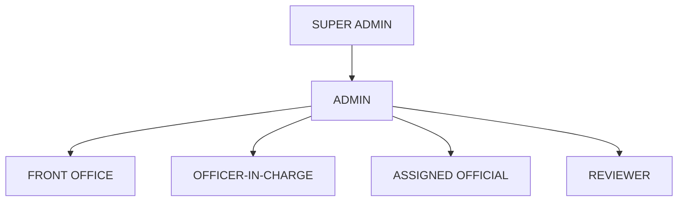

# 3. Stakeholders and Roles

## 3.1 Roles

| Role                | Summary                                                                  |
| ---------------------| --------------------------------------------------------------------------|
| `SUPER_ADMIN`       | Full system configuration access.                                        |
| `ADMIN`             | System configuration (users, categories) without super-admin-only areas. |
| `FRONT_OFFICE`      | Registers/verifies incoming queries, dispatches approved responses.      |
| `OFFICER_IN_CHARGE` | Assigns queries, grants final approval.                                  |
| `ASSIGNED_OFFICIAL` | Drafts the response for an assigned query.                               |
| `REVIEWER`          | Reviews a draft at one review level.                                     |

`INQUIRER` also exists in the mock user dataset (the external party who submitted the query)
but is not part of the internal role hierarchy below — inquirers do not log into QMS.

## 3.2 Role Hierarchy

**This hierarchy does not automatically mean a higher role can perform every workflow
action.** It only expresses configuration/reporting seniority. Actual permissions per
workflow action (assign, draft, review, transfer, pull back, approve, dispatch) are explicit
— see [workflow/role-permission-matrix.md](../workflow/role-permission-matrix.md).

## 3.3 Mock Users

The frontend prototype uses a centralized, fictional user dataset (`frontend/src/constants/mockUsers.js`)
— these are development identities only, not real IPC employees:

| ID | Name | Role | Division |
| --- | --- | --- | --- |
| USR-0001 | Rajesh Kumar | INQUIRER | — |
| USR-0002 | Priya Sharma | FRONT_OFFICE | Administration |
| USR-0003 | Anil Verma | OFFICER_IN_CHARGE | Training & Development |
| USR-0004 | Neha Singh | ASSIGNED_OFFICIAL | Training & Development |
| USR-0005 | Amit Mehta | REVIEWER | Policy & Compliance |
| USR-0006 | Kavita Rao | REVIEWER | Policy & Compliance |
| USR-0007 | Suresh Gupta | ADMIN | Administration |
| USR-0008 | System Administrator | SUPER_ADMIN | Administration |

The mock frontend session is seeded as **Neha Singh (USR-0004, ASSIGNED_OFFICIAL)**.
