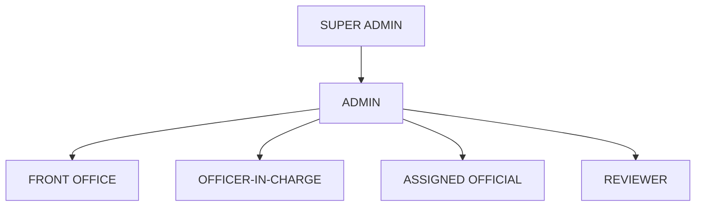

# 3. Stakeholders and Roles

## 3.1 Roles

| Role                | Summary                                                                  |
| ---------------------| --------------------------------------------------------------------------|
| `SUPER_ADMIN`       | Full system configuration access.                                        |
| `ADMIN`             | System configuration (users, categories) without super-admin-only areas. |
| `FRONT_OFFICE`      | Registers/verifies incoming queries. Holds the dispatch permission, now used only to retry a send that did not complete. |
| `OFFICER_IN_CHARGE` | Assigns queries, grants final approval — which dispatches the response.  |
| `ASSIGNED_OFFICIAL` | Drafts the response for an assigned query.                               |
| `REVIEWER`          | Reviews a draft at one review level.                                     |

| `INQUIRER`          | The party who submitted the query. Raises enquiries and tracks their own cases. |

`INQUIRER` sits outside the internal approval hierarchy shown below, but **is a signed-in role** in
the implementation: it holds a dashboard, a Raise Enquiry form and read access to its own cases
(`ROLE_SECTIONS[INQUIRER]` in `frontend/src/constants/permissions.js`). An earlier draft of this
document said inquirers do not log in; that is no longer accurate. Seven roles in total.

## 3.2 Role Hierarchy

**This hierarchy does not automatically mean a higher role can perform every workflow
action.** It only expresses configuration/reporting seniority. Actual permissions per
workflow action (assign, draft, review, transfer, pull back, approve, dispatch) are explicit
— see [workflow/role-permission-matrix.md](../workflow/role-permission-matrix.md).

## 3.3 Mock Users

Thirteen development identities are seeded from `backend/src/constants/users.js` (mirrored for
display in `frontend/src/constants/mockUsers.js`, which the backend file is authoritative over).
These are development identities only, not real IPC employees:

| ID | Name | Role |
| --- | --- | --- |
| USR-0001 | Abhinash Pritiraj | INQUIRER |
| USR-0002 | Bhumika Makker | FRONT_OFFICE |
| USR-0003 | Jatin Rawat | OFFICER_IN_CHARGE |
| USR-0004 | Neha Singh | ASSIGNED_OFFICIAL |
| USR-0009 | Rawat Jatin | ASSIGNED_OFFICIAL |
| USR-0010 | Meera Iyer | ASSIGNED_OFFICIAL |
| USR-0011 | Arjun Nair | ASSIGNED_OFFICIAL |
| USR-0012 | Sana Qureshi | ASSIGNED_OFFICIAL |
| USR-0013 | Vikram Desai | ASSIGNED_OFFICIAL |
| USR-0005 | Amit Mehta | REVIEWER |
| USR-0006 | Kavita Rao | REVIEWER |
| USR-0007 | Suresh Gupta | ADMIN |
| USR-0008 | System Administrator | SUPER_ADMIN |

Note `Rawat Jatin` (USR-0009) and `Jatin Rawat` (USR-0003) are **different people** — a deliberate
near-collision the test suite pins, so name-matching code cannot conflate them.

**The INQUIRER row is not the inquirer.** A real inquirer is any member of the public who emails the
Front Office mailbox; they hold no account here and sign in to nothing. Their name and address are
read off the incoming message and stored on the case, so the system supports arbitrarily many
inquirers against one mailbox. USR-0001 exists only to exercise the in-app "Raise Enquiry" test
harness.

There is a real login screen; all accounts share the development password `QMS_SEED_PASSWORD`. Full
detail, including each role's landing dashboard and section access, is in
[docs/auth.md](../auth.md).
