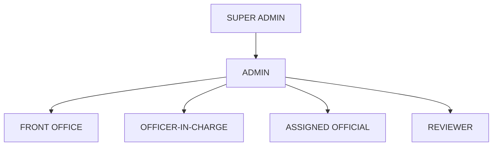

# 3. Stakeholders and Roles

## 3.1 Roles

| Role                | Summary                                                                  |
| ---------------------| --------------------------------------------------------------------------|
| `SUPER_ADMIN`       | Full system configuration access.                                        |
| `ADMIN`             | System configuration (users, categories) without super-admin-only areas. |
| `FRONT_OFFICE`      | Registers/verifies incoming queries. Holds the dispatch permission, now used only to retry a send that did not complete. |
| `OFFICER_IN_CHARGE` | Assigns queries, grants final approval — which dispatches the response.  |
| `ASSIGNED_OFFICIAL` | Drafts the response for an assigned query.                               |
| `REVIEWER`          | Reviews a draft at one review level.                                     |

**Six roles, and the inquirer is not one of them.** An inquirer is a **stakeholder but not an
account**: a member of the public who emails the Front Office mailbox, whose name and address are
read off the `From` header at intake, and who signs in to nothing. An implementation that briefly
made `INQUIRER` a seventh signing-in role — with a dashboard, a Raise Enquiry form and read access
to its own cases — has been reverted; `ROLES` in `frontend/src/constants/roles.js` and
`backend/src/constants/roles.js` now list exactly the six above, and there are no `/inquirer/*`
routes. See
[14-open-questions-and-client-clarifications.md](./14-open-questions-and-client-clarifications.md#roles)
for the sign-off this narrowing still needs.

## 3.2 Role Hierarchy

**This hierarchy does not automatically mean a higher role can perform every workflow
action.** It only expresses configuration/reporting seniority. Actual permissions per
workflow action (assign, draft, review, transfer, pull back, approve, dispatch) are explicit
— see [workflow/role-permission-matrix.md](../workflow/role-permission-matrix.md).

## 3.3 Mock Users

Twelve development identities are seeded from `backend/src/constants/users.js` (mirrored for
display in `frontend/src/constants/mockUsers.js`, which the backend file is authoritative over).
These are development identities only, not real IPC employees, and every address is on
`@ipc.example`, which RFC 2606 reserves and which cannot receive mail:

| ID | Name | Role |
| --- | --- | --- |
| USR-0002 | Front Office (primary mailbox) | FRONT_OFFICE |
| USR-0003 | Jatin Rawat | OFFICER_IN_CHARGE |
| USR-0004 | Neha Singh | ASSIGNED_OFFICIAL |
| USR-0009 | Rawat Jatin | ASSIGNED_OFFICIAL |
| USR-0010 | Meera Iyer | ASSIGNED_OFFICIAL |
| USR-0011 | Arjun Nair | ASSIGNED_OFFICIAL |
| USR-0012 | Sana Qureshi | ASSIGNED_OFFICIAL |
| USR-0013 | Vikram Desai | ASSIGNED_OFFICIAL |
| USR-0005 | Amit Mehta | REVIEWER |
| USR-0006 | Kavita Rao | REVIEWER |
| USR-0007 | Suresh Gupta | ADMIN |
| USR-0008 | System Administrator | SUPER_ADMIN |

Note `Rawat Jatin` (USR-0009) and `Jatin Rawat` (USR-0003) are **different people** — a deliberate
near-collision the test suite pins, so name-matching code cannot conflate them.

**No row here is the inquirer.** A real inquirer is any member of the public who emails the Front
Office mailbox; they hold no account here and sign in to nothing. Their name and address are read off
the incoming message and stored on the case, so the system supports arbitrarily many inquirers
against one mailbox. There used to be a `USR-0001` / `INQUIRER` row; it existed only to exercise the
in-app "Raise Enquiry" harness, and both are gone.

A thirteenth account, `USR-0014`, is added from configuration rather than listed above when
`NIC_BROWSER_MAILBOX=true`: a second `FRONT_OFFICE` identity that signs in as `NIC_EMAIL` and owns
the NICeMail mailbox.

There is a real login screen, and **each account has its own credential**, resolved per account in
that order: `QMS_PASSWORDS_FILE` (a JSON file of userId → password, kept outside the repository),
then `QMS_PASSWORD_<USER_ID>`. Accounts do **not** share one password. `QMS_SEED_PASSWORD` is a
credential source only in the shared mode that the per-account hashes replaced —
`QMS_ALLOW_SHARED_PASSWORD=true` turns it on, `false` off, and left unset it is on outside
production whenever `QMS_SEED_PASSWORD` is non-empty, in which case that one secret opens every
account including `SUPER_ADMIN`. Full detail, including each role's landing dashboard and section
access, is in [docs/auth.md](../auth.md).
