# 5. Workflow and State Machine

## 5.1 Business Status vs Workflow State

QMS tracks two **separate** fields on every query — never derive one by parsing the other:

- **Business Status** — the coarse, client-facing lifecycle summary:
  `OPEN`, `IN_PROGRESS`, `CLOSED`.
- **Workflow State** — the fine-grained internal step the query is currently at:
  `RECEIVED`, `FRONT_OFFICE_VERIFICATION`, `PENDING_ASSIGNMENT`, `ASSIGNED`, `DRAFTING`,
  `UNDER_REVIEW`, `PENDING_FINAL_APPROVAL`, `APPROVED`, `READY_FOR_DISPATCH`, `DISPATCHED`,
  `CLOSED`, `RETURNED_FOR_REVISION`, `TRANSFERRED`, `PULLED_BACK`, `ON_HOLD`, `CANCELLED`.

Many workflow states map to the same business status — e.g. `ASSIGNED`, `DRAFTING`, and
`UNDER_REVIEW` are all `IN_PROGRESS` at the business-status level. This distinction exists so
the UI can show inquirers/managers a simple status while the system tracks precise internal
state.

## 5.2 Primary Illustrative Workflow

The diagram below walks the primary dummy query, `QRY-2026-00427`, through the full lifecycle.
**It illustrates a sample workflow with two review levels — the actual system supports a
dynamic number of review levels** (see [architecture/workflow-engine.md](../architecture/workflow-engine.md)),
so a real query might have one review level, four, or any other count without changing the
underlying model.

```mermaid
flowchart TD

    START([Incoming Query Email])

    subgraph INQUIRER["Inquirer"]
        A["Rajesh Kumar<br/><br/>
        Sends Email Query<br/>
        Subject: Clarification regarding eligibility criteria<br/>
        for Government Training Programme"]
    end

    subgraph FO1["Phase 1 — Front Office: Query Intake"]
        B["Priya Sharma<br/><b>Front Office</b><br/><br/>
        Receives Email"]

        C["System creates Query Case<br/><br/>
        Query ID: QRY-2026-00427<br/>
        Status: OPEN<br/>
        Source: Email<br/>
        Priority: NORMAL"]

        D["Email + Attachments<br/>
        stored against Query Case"]

        E["Front Office verifies<br/>
        basic query details"]

        F["Forward Query to<br/>
        Officer-in-Charge"]
    end

    subgraph ASSIGN["Phase 2 — Assignment"]
        G["Anil Verma<br/><b>Officer-in-Charge</b><br/><br/>
        Receives Query"]

        H["AI Assignment Assistant<br/><br/>
        Analyses:<br/>
        • Query category<br/>
        • Subject/expertise<br/>
        • Previous assignments<br/>
        • Current workload"]

        I["AI Recommendation<br/><br/>
        Suggested Official:<br/>
        Neha Singh<br/>
        Match: 92%"]

        J{"OIC Decision"}

        K["Assign to<br/>Neha Singh"]

        L["Manual Override<br/>
        Select another official"]
    end

    subgraph DRAFT["Phase 3 — Investigation & Drafting"]
        M["Neha Singh<br/><b>Assigned Official</b><br/><br/>
        Query Assigned"]

        N["Status → IN PROGRESS<br/><br/>
        Workflow State → DRAFTING"]

        O["Examines Query<br/>
        Reviews Attachments<br/>
        Researches Applicable Information"]

        P["AI Draft Assistant<br/><br/>
        Generates Initial Response"]

        Q["AI Generated Draft<br/>
        Response Version: v1"]

        R["Neha reviews & edits<br/>
        AI-generated response"]

        S["Final Draft v1<br/>
        Ready for Review"]
    end

    subgraph REVIEW["Phase 4 — Dynamic Review Workflow"]
        T["Review Level 1<br/><br/>
        Amit Mehta<br/>
        Reviewer-I"]

        U{"Review-I Decision"}

        V["Approved"]

        W["Changes Required"]

        X["Comments / Revision<br/>
        requested from Neha"]

        Y["Neha updates response<br/>
        Response Version: v2"]

        Z["Review Level 2<br/><br/>
        Kavita Rao<br/>
        Reviewer-II"]

        AA{"Review-II Decision"}

        AB["Approved"]

        AC["Changes Required"]

        AD["Neha revises response<br/>
        Response Version: v3"]
    end

    subgraph APPROVAL["Phase 5 — Final Approval"]
        AE["Anil Verma<br/><b>Officer-in-Charge</b><br/><br/>
        Receives Reviewed Draft"]

        AF{"Final Approval Decision"}

        AG["Approved<br/>
        Final Response Locked"]

        AH["Return for Revision"]

        AI["Neha revises response<br/>
        New Response Version"]
    end

    subgraph DISPATCH["Phase 6 — Response & Closure"]
        AJ["Priya Sharma<br/><b>Front Office</b><br/><br/>
        Receives Approved Response"]

        AK["Final Response Preview<br/>
        Verify Recipient & Attachments"]

        AL["Send Response to<br/>
        Rajesh Kumar"]

        AM["Outgoing Email +<br/>
        Delivery Details Stored"]

        AN["Query Status → CLOSED"]

        AO["Complete Audit Trail<br/>
        & Query History"]
    end

    subgraph AUDIT["Cross-Cutting — Audit & Tracking"]
        AUD["Every major action recorded:<br/><br/>
        Received → Forwarded → Assigned → Drafted → Reviewed<br/>
        → Revised → Approved → Dispatched → Closed"]
    end

    START --> A
    A --> B
    B --> C
    C --> D
    D --> E
    E --> F

    F --> G
    G --> H
    H --> I
    I --> J

    J -->|Accept AI Recommendation| K
    J -->|Choose Different Official| L

    K --> M
    L --> M

    M --> N
    N --> O
    O --> P
    P --> Q
    Q --> R
    R --> S

    S --> T
    T --> U

    U -->|Approve| V
    U -->|Return| W

    W --> X
    X --> Y
    Y --> T

    V --> Z
    Z --> AA

    AA -->|Approve| AB
    AA -->|Return| AC

    AC --> AD
    AD --> Z

    AB --> AE
    AE --> AF

    AF -->|Approve| AG
    AF -->|Return| AH

    AH --> AI
    AI --> S

    AG --> AJ
    AJ --> AK
    AK --> AL
    AL --> AM
    AM --> AN
    AN --> AO

    C -.-> AUD
    F -.-> AUD
    K -.-> AUD
    M -.-> AUD
    Q -.-> AUD
    T -.-> AUD
    Y -.-> AUD
    Z -.-> AUD
    AD -.-> AUD
    AG -.-> AUD
    AL -.-> AUD
    AN -.-> AUD
```

## 5.3 Notes on Exceptional Transitions

`TRANSFERRED`, `PULLED_BACK`, `ON_HOLD`, and `CANCELLED` are not shown on the diagram above
because they are exceptional transitions available from most in-progress states, not steps in
the normal path. See [workflow/workflow-rules.md](../workflow/workflow-rules.md) for what's
confirmed vs pending client clarification for transfer and pullback.
